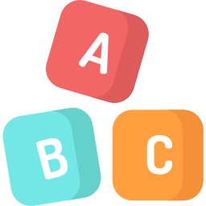

<h1> Vocabulary Quiz API </h1>


<p align="center"><a href="https://laravel.com" target="_blank"></a></p>


## Project Overview

Vocabulary Quiz API is a quiz-based environment to practice vocabulary in challenging approach. This project is developed using Laravel and Sanctum as a REST API.

### Main Features:

- API Versions V1 / V2 .....
- Query Filters
- Data Maniplation (Resources)
- Test-driven development TDD (Features Tests)
- Manage Notifications
- Reports (PDFs)


## API Usage Examples

```
[HTTP_METHOD] [URL]
Authorization: Bearer TOKEN GOES HERE
Content-Type: application/json
```

### Retreive Vocabulary' list

```
GET /api/V1/vocabulary
```

### Create Vocabulary
```
POST /api/V1/vocabulary
BODY:
{
    "vocabulary" : "first_vocabulary",
    "complexity" : "medium"
}
```

### Using query filter on Quiz 
```
GET /api/V1/quiz?creationType[eq]=random
```

### Create Quiz
```
POST /api/V1/vocabulary
BODY:
{
    "name" : "My first Quiz",
    "player_id" : "21",
    "creation_type" : "random",
    "start_time" : "2023-06-01 00:05:00",
    "end_time" : "2023-06-01 00:15:00"
}
```

### Credits

- Thanks for Laravel framework, make sure to check [Laravel Official README file](/README%20Laravel.md) for credits,libraries, license and any other related question.
- Thanks for [Laravel-dompdf](https://github.com/barryvdh/laravel-dompdf) library.
- Thanks for the [REST API Tutrial](https://www.youtube.com/watch?v=YGqCZjdgJJk) for explaining the Sanctum REST API Filtering


- README icon from
<a href="https://www.flaticon.com/free-icons/abc" title="abc icons">Abc icons created by Freepik - Flaticon</a>


